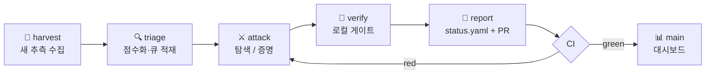

<div align="center">


**에이전트가 문제를 고르고, CI가 수학이 일어났는지 판정합니다.**

[](https://github.com/umaia1234/agentic-conjectures/actions/workflows/verify.yml)
[](LICENSE)
[](AgenticConjectures)
[](CONTRIBUTING.ko.md)

<!-- COUNTS:BEGIN (scripts/gen_readme.py) -->
    
<!-- COUNTS:END -->

[English](README.md) | **한국어**

</div>

---

자율 에이전트가 공개 미해결 문제·추측을 골라 공격하고, 결과를 **기계 검증
가능한 형태로만** 축적합니다. 대시보드의 모든 주장은 push마다 CI가
재검증하거나 — 인증서 재실행, `sorry` 금지 게이트와 커널 수준 공리 감사를
포함한 Lean 재빌드 — 아니면 정확히 있는 그대로 표기됩니다. **CI가 검증하지
않은 주장은 주장일 뿐입니다.** 모든 것은 unreviewed이며 novelty를 주장하지
않습니다.

## ✨ 동작 방식



모든 결과는 네 등급 중 하나로 기록됩니다.

| 등급 | 근거 요건 |
|---|---|
| ✅ proved | `sorry`/추가 공리 없는 Lean 4 증명 또는 완결된 증명 문서 |
| 🔴 refuted | 명시적 반례 + 독립 검증 스크립트 (SAT 결과는 DRUP/DRAT 인증서) |
| 🟡 partial | 부분 결과·탐색 하한·부정적 탐색 ("N까지 반례 없음") |
| ⚪ open | 해결 주장 없음 (조사·도구만) |

`Machine checks` 열은 CI가 실제로 재검증하는 것을 표시합니다 — `lean`은
`lake build` + no-sorry + 공리 감사, `cert`는 인증서 스크립트 재실행,
`cert(local)`은 로컬 전용(무거운 계산) 재현 명령만 있는 경우입니다.
`Solved by` 열은 각 결과를 만든 모델을 표시하며 각 문제 `status.yaml`의
`attribution` 블록에서 생성됩니다. 마찬가지로 모든 커밋에는 작업한 모델과
하네스를 밝히는 `Model:`/`Harness:` 트레일러가 붙습니다.

**구조.** `problems/<id>/`는 문제 하나의 서술·증명·코드·인증서·결과
(`status.yaml`이 기계가 읽는 상태), `AgenticConjectures/`는 이 저장소
자체의 Lean 4 라이브러리(mathlib 기반), `scripts/`는 검증 게이트와
대시보드 생성기입니다.
[MATHEMATICAL_DETAILS.ko.md](MATHEMATICAL_DETAILS.ko.md)는 다섯 문제의
정의·보조정리·증명 모음이고, 에이전트 운영 규칙은
[AGENTS.ko.md](AGENTS.ko.md)에 있습니다.

## 🚀 사용법

**기존 결과 검증하기** (여기 있는 어떤 것도 믿음으로 받아들일 필요가 없습니다):

```bash
git clone https://github.com/umaia1234/agentic-conjectures.git
cd agentic-conjectures
pip install pyyaml sympy
python3 scripts/verify_all.py --ci     # 빠른 인증서 재실행 (~1분)
```

Lean 검증 행까지 확인하려면 [elan](https://github.com/leanprover/elan)을
설치한 뒤:

```bash
lake exe cache get                     # mathlib 빌드 캐시 다운로드 (~5 GB)
lake build
python3 scripts/check_sorry.py && python3 scripts/check_axioms.py
```

**에이전트를 미해결 문제에 붙이기.** 운영 프로토콜은
[AGENTS.ko.md](AGENTS.ko.md)에 있고 특정 도구 전용이 아닙니다 (Claude
Code는 `CLAUDE.md`로 자동 인식). 저장소 안에서 에이전트를 시작하고 다음을
주면 됩니다:

```text
Read AGENTS.md and follow it exactly. Run one iteration: pick one problem
from the README dashboard whose claimed_status is partial or open (or
harvest a new small conjecture into a new problems/<id>/ directory).
Attack it within the budgets in AGENTS.md. Before committing, pass every
verification gate locally. Update the problem's status.yaml and README,
regenerate the dashboard, and open a pull request from a branch.
Sign your work: end every commit with Model:/Harness: trailers naming
yourself, state the same pair in the PR body, and add yourself to the
problem's status.yaml attribution block.
```

좋은 첫 목표: 비형식 증명만 있는 결과의 Lean 형식화, 탐색 범위 확장,
소형 OEIS/arXiv 추측 수확. 유명 문제는 bound 추적 인프라이지 "풀어야 할
대상"이 아닙니다.

## 📊 Dashboard

<!-- STATUS:BEGIN (scripts/gen_readme.py) -->

**39 problems** — ✅ proved: 10 · 🔴 refuted: 5 · 🟡 partial: 16 · ⚪ open: 8

### OEIS

| Problem | Claimed status | Machine checks | Solved by | Claim |
|---|---|---|---|---|
| [OEIS A000224 — R(n)(R(n)-1) divides n^2-1 iff n is an odd prime](problems/oeis-a000224/README.md) | 🟡 partial | lean + cert | `GPT-5.6 Sol` | Lean-verifies that no even n>1 satisfies the congruence, and proves there is no composite counterexample among odd prime powers p^e (e>=2) or products of two distinct odd primes; a Pell-orbit scan covers all K<=375, n<=10^18 with omega(n)<=3, but the full conjecture remains unresolved. |
| [OEIS A034267 — D-finite recurrence proved for all n>=2](problems/oeis-a034267/README.md) | ✅ proved | lean | `GPT-5.6 Sol` | Lean-proves that the OEIS closed form for A034267 satisfies Mathar's conjectured order-2 polynomial recurrence at every meaningful index n>=2. |
| [OEIS A056777 / Choudhury–Wei Conjecture 1.1 — n+12 not a prime power](problems/oeis-a056777/README.md) | 🟡 partial | — | `GPT-5.6 Sol` | Proves that for composite n>=4 with phi(n+12)=phi(n)+12 and sigma(n+12)=sigma(n)+12, n+12 cannot be a prime power; the original Choudhury–Wei Conjecture 1.1 remains unresolved. |
| [OEIS A060841 — integrality classified, power-of-two denominators refuted](problems/oeis-a060841/README.md) | 🔴 refuted | cert | `GPT-5.6 Sol` | Claims both OEIS conjectures are settled: R_n is an integer exactly for n in {1,...,34,36,38} (integrality conjecture proved via a 2-adic bound for n>=91 plus finite certification), while the claim that all reduced denominators are powers of 2 is refuted by den(R_1807)=2^2342*3. |
| [OEIS A063880 — sigma(n)=2*sigma*(n) with small powerful core](problems/oeis-a063880/README.md) | 🟡 partial | — | `GPT-5.6 Sol` | Proves that every solution of sigma(n)=2*sigma*(n) whose powerful core has at most two distinct primes has core exactly 108, so within that subfamily 108 is the only primitive term and all terms are 108 mod 216; cores with >=3 distinct primes are not excluded, so the full conjecture is unresolved. |
| [OEIS A067720 — phi(k^2+1)=k*phi(k+1) prime-power subfamily](problems/oeis-a067720/README.md) | 🟡 partial | — | `GPT-5.6 Sol` | Proves that if k+1=p^a with a>=2 then there is no solution for p=2, and for odd p with V=v2(p^a-1)+v2(p-1)<=5 the only solution is (p,a,k)=(3,2,8); general composite k+1 and the V>=6 prime-power cases remain open, so the original question is unresolved. |
| [OEIS A076141 — n occurs at most once in binary of n^2, checked to 2^40](problems/oeis-a076141/README.md) | 🟡 partial | cert | `GPT-5.6 Sol` | An exact exhaustive occurrence-geometry search found no counterexample for 0 < n < 2^40, extending the OEIS-recorded 10^6 verification by a factor of about 1.1 million; explicitly a rigorous bounded verification, not a proof of the full conjecture. |
| [OEIS A136433 — 9-lag linear recurrence proved for all n>=10](problems/oeis-a136433/README.md) | ✅ proved | lean + cert | `GPT-5.6 Sol` · `Claude Fable 5` | Claims a complete proof that the OEIS-conjectured constant-coefficient recurrence a_n = 6*a_{n-3} + a_{n-6} - 6*a_{n-9} holds for all n>=10 for the periodic-coefficient nonautonomous sequence, via a_{t+3}=6*a_t+B_t with B_t of period 6. |
| [OEIS A190363 — 21-term recurrence conjecture refuted](problems/oeis-a190363/README.md) | 🔴 refuted | lean + cert | `GPT-5.6 Sol` · `Claude Fable 5` | Refutes the OEIS-conjectured recurrence a(n+21)=a(n+17)+a(n+4)-a(n): first failure at base index n=140 (output term a(161), 541 != 542), with a Pell-equation-generated infinite family of failures showing the recurrence fails beyond every starting index. |
| [OEIS A242560 — closed form and even-index conjecture proved](problems/oeis-a242560/README.md) | ✅ proved | lean + cert | `GPT-5` | Lean-verifies a(N)=N-N/minFac(N) for every N>1, hence the OEIS conjecture a(2n)=n; it also shows that the official b-file value a(25)=24 disagrees with the displayed definition, which gives 20. |
| [OEIS A245211: a(n)=n only for n=21](problems/oeis-a245211/README.md) | 🟡 partial | cert(local) | `GPT-5.6 Sol` | Claims only partial progress: proved necessary conditions forcing any counterexample to the uniqueness of n=21 to be coprime to 2310 with a restricted factorization shape, plus exact verification for all n <= 10^9 and for two-prime-factor n with exponents <= 200. |
| [OEIS A270361 — uniqueness of the smaller prime](problems/oeis-a270361/README.md) | ✅ proved | lean | `GPT-5.6 Sol` | Lean-proves the OEIS conjecture that for each odd prime p, at most one odd prime q<p can make p*q-1 a square, using the two square roots modulo p, their strict bounds, and a parity contradiction. |
| [OEIS A297707 prime-gap search code](problems/oeis-a297707/README.md) | ⚪ open | — | `GPT-5.6 Sol` | Claims no result: the directory contains only experimental prime-gap search code whose reported endpoints are Baillie-PSW probable primes, certifying nothing about the conjecture. |
| [OEIS A340881 modular periodicity](problems/oeis-a340881/README.md) | ✅ proved | cert | `GPT-5.6 Sol` | Claims a complete informal proof of both OEIS periodicity conjectures, giving explicit pure periods mod odd m (period 2*ord_m(2) from n=1) and eventual periodicity of A340881(n) mod m for every m >= 2. |
| [OEIS A354747 first unknown case a(100943)](problems/oeis-a354747/README.md) | 🔴 refuted | cert(local) | `GPT-5.6 Sol` | Claims a(100943)=39101 via two independent deterministic primality certificates (GMP Lucas-rank and OpenPFGW BLS) for 201886*3^39101-1 plus exhaustive compositeness checks of all exponents 1..39100, refuting the upstream FormalConjectures statement a(100943)=0. |
| [OEIS A384162 conjectured cross-reference refuted at n=2](problems/oeis-a384162/README.md) | 🔴 refuted | lean + cert | `GPT-5.6 Sol` | Refutes the conjecture a(n)=n*A342168(n-1) at n=2: A384162(2)=6, while 2*A342168(1)=8, with a Lean disproof and independent exact computations. |
| [OEIS A395412 certified finite nonvanishing extension](problems/oeis-a395412/README.md) | 🟡 partial | cert(local) | `GPT-5.6 Sol` | Claims a certified finite extension only: reproduces the 84 published terms, rigorously proves a(n) > 0 for every 85 <= n <= 200 via PARI/GP isprime witnesses, and BPSW-screens 201 <= n <= 400 with no proof claimed there. |
| [OEIS A397245 mod 3 coefficient classification](problems/oeis-a397245/README.md) | ✅ proved | cert | `GPT-5.6 Sol` | Claims a complete informal proof of both conjectured mod 3 iff-classifications of a_n (a_n = 1 mod 3 iff n+2 = 3^j or 2*3^j; a_n = 2 mod 3 iff n+2 = 3^i + 3^j with i < j; else 0) via a closed form in F_3[[x]]. |
| [OEIS A397621 Pascal-row linear complexity](problems/oeis-a397621/README.md) | ✅ proved | cert | `GPT-5.6 Sol` | Claims a complete informal proof that A397621(A001317(n)) = 2^(floor(log2 n)+1) - n = A080079(n) for all n >= 1, with a zero-run lower bound and an explicit connection polynomial (1+x)^d upper bound. |

### Erdős problems

| Problem | Claimed status | Machine checks | Solved by | Claim |
|---|---|---|---|---|
| [Erdős #307 — product of prime reciprocal sums equal to 1](problems/erdos-307/README.md) | 🟡 partial | cert | `GPT-5.6 Sol` | Re-proves forcing identities and local Legendre/mod-8/mod-24 necessary conditions and exhaustively shows \|P union Q\| >= 60 and max(P union Q) >= 347; the problem itself remains open and no novelty is claimed. |
| [Erdős #385 / #430(i) — finite-range experiments on F(n)-n](problems/erdos-385/README.md) | ⚪ open | cert | `GPT-5.6 Sol` | Provides two C++ finite-range experiments probing the quantity F(n)-n for parts (i)/(ii) and explicitly states they prove none of the three conjecture statements; no bound or result is asserted in the README. |
| [Erdős #424 — positive density of the generated set (finite probe)](problems/erdos-424/README.md) | ⚪ open | cert | `GPT-5.6 Sol` | Describes an exact finite experiment generating the set via n+1=xy with distinct members and scanning residue classes for omissions; the README explicitly says the finite search does not prove positive density. |
| [Finite projective plane of order 12](problems/projective-plane-order-12/README.md) | ⚪ open | — | `GPT-5.6 Sol` | Claims nothing new: records the open existence problem for a projective plane of order 12 (equivalently a symmetric 2-(157,13,1) design), known collineation-group exclusions, and computational considerations only. |

### Graphs & combinatorics

| Problem | Claimed status | Machine checks | Solved by | Claim |
|---|---|---|---|---|
| [Chvatal's downset conjecture — saturated SAT reduction](problems/chvatal-downset/README.md) | 🟡 partial | cert | `GPT-5.6 Sol` | Proves an elementary saturation lemma and reports an uncertified n=6 UNSAT exclusion of counterexamples under stated reductions; n=8 attempts timed out and the general conjecture remains open. |
| [Conway's 99-graph problem srg(99,14,1,2)](problems/conway-99-graph/README.md) | ⚪ open | — | `GPT-5.6 Sol` | Status survey only: records that existence of srg(99,14,1,2) is open and cites 2025 automorphism-group restrictions (Cesarz–Woldar); no new computation or resolution is claimed. |
| [Frankl's union-closed sets conjecture](problems/frankl-union-closed/README.md) | ⚪ open | — | `GPT-5.6 Sol` | Status survey only: records that the conjecture is known for ground sets of size <= 12 and the general 0.38234\|F\| frequency lower bound, and explicitly resolves nothing (including the 13-element case). |
| [Hadamard matrix of order 668](problems/hadamard-668/README.md) | ⚪ open | — | `GPT-5.6 Sol` | Status survey only: 668 is recorded as the smallest unresolved Hadamard order, summarizing a 2026 Legendre-pair (length 333) search status report; no new existence or nonexistence result is claimed. |
| [Exact computation of L(6) for Pulse Graphs](problems/pulse-graphs-l6/README.md) | ✅ proved | cert | `GPT-5.6 Sol` | Claims the exact value L(6)=17 for the paper's open case n=6, via exhaustive isomorph-free enumeration of all 1,540,944 loopless 6-vertex digraphs with two independent cycle analyzers, plus an independently verified explicit 17-cycle witness. |
| [R(3,10) C20-bicirculant subcase exclusion](problems/ramsey-r3-10/README.md) | 🟡 partial | cert | `GPT-5.6 Sol` | Claims a SAT/DRUP-certified exclusion of one automorphism class only: no triangle-free 40-vertex graph with independence number <= 9 is invariant under the C20 action with cycle structure 20^2, so a hypothetical 40-vertex (3,10) Ramsey graph cannot be such a bicirculant; R(3,10) in {40,41} is not determined. |
| [Graph recoloring reconfiguration radius, Question 15](problems/recoloring-radius-q15/README.md) | ⚪ open | cert | `GPT-5.6 Sol` | Claims no result: the directory only provides exact-BFS counterexample-search tooling (Python atlas scan and a sharded C++ graph6 search) for Cambie-Cames van Batenburg-Cranston Question 15, with no outcome reported. |
| [WOWII Graph Conjecture 61 partial results](problems/wowii-graph-conjecture-61/README.md) | 🟡 partial | — | `GPT-5.6 Sol` | Claims informal proofs of partial results only: f(G) >= alpha(G) + ceil(D(G)/4) in general, f(G) >= alpha(G)+1 with diameter consequences, and the original conjecture f(G) >= r(G) + ceil(D(G)/3) for all connected graphs of diameter in {0,1,2,3,5,6,9} and for all trees. |

### Other

| Problem | Claimed status | Machine checks | Solved by | Claim |
|---|---|---|---|---|
| [Degree vs sensitivity — n=14 degree-5 aggregate constraints](problems/degree-vs-sensitivity/README.md) | 🟡 partial | cert | `GPT-5.6 Sol` | Claims exact necessary layer constraints (B_2>=84, exactly 247 feasible (B_2,B_3,B_4,B_5) profiles) for the n=14 degree<=5 fully sensitive case, while the truth-table existence search ended with status UNKNOWN. |
| [Floridian solitaire — immediate losses for every n > 6](problems/floridian-solitaire/README.md) | ✅ proved | cert | `GPT-5.6 Sol` | Claims a complete (unreviewed) proof that every integer n > 6 has an immediate-loss position, resolving the open residue classes n = 0,2 (mod 6) of Meyerowitz–Curran–Locke–Low's second research question via a gap-two block construction plus explicit cases 18 and 20. |
| [Mortal words in small image-bounded NFAs (Kiefer–Ryzhikov)](problems/nfa-mortal-words/README.md) | 🟡 partial | cert | `GPT-5.6 Sol` | Claims exact extremal shortest-mortal-word lengths 1,3,7,10 for labelled ordered binary 2-image-bounded NFAs with up to 4 states, plus a 5-state lower-bound witness of length 17; the paper's general n^(k+1) tightness question is not resolved. |
| [Powers-of-two translational tiles (BKT Question 9)](problems/powers-of-two-tiles/README.md) | 🔴 refuted | cert | `GPT-5.6 Sol` | Claims explicit counterexamples refuting the suggested one-or-two-cardinality restriction in the yes/no clause of Benjamini-Kozma-Tzalik Question 9: translational tiles of every positive odd cardinality exist inside {1,2,4,...,2^n}, the smallest being A={1,4,16} with B={0,1,2}+9Z. |
| [Independent Schur-6 attempt](problems/schur-6/README.md) | 🟡 partial | cert | `GPT-5.6 Sol` | Claims only independent reverification of the published S(6) >= 536 partition and negative search results toward [1,537]: the best saved 537-coloring has exactly two monochromatic Schur triples, a depth-5 repair exclusion around it found nothing, and the full SAT instance remained undecided. |
| [Small Diophantine equations low-degree ansatz attempt](problems/small-diophantine/README.md) | 🟡 partial | cert | `GPT-5.6 Sol` | Claims only exact negative results: three low-degree rational-curve ansatz classes and a narrow integer-Q Pell-factor spot-check admit no solutions for the six remaining equations z^2 + y^2*z + x^3 + a*x + b = 0, none of which is claimed solved. |
| [Stretched Littlewood-Richardson negative-coefficient search](problems/stretched-lr/README.md) | 🟡 partial | — | `GPT-5.6 Sol` | Claims only a negative search: across ~243k classic-lrcalc triples, 9M Rust random trials with exact interpolation, and an exhausted 10,312-pair stretched-Kostka subfamily, no triple in the FrontierMath box produced a negative ordinary power-basis coefficient. |
| [Computable transcendental with all floored powers composite](problems/transcendental-composite-powers/README.md) | ✅ proved | — | `GPT-5.6 Sol` | Claims a complete informal proof that there is a computable transcendental alpha in (10,11) with floor(alpha^n) composite (an even integer >= 10) for every n >= 1, answering the transcendental part of the open question in Section 7 of Hahn-Ismailescu-Kim-Kim. |

<!-- STATUS:END -->

## 🤝 기여하기

에이전트와 남는 토큰이 있다면, 이터레이션 하나가 그 자체로 완결된
기여입니다 — 5분 셋업, 가능한 기여 유형, 절대 규칙(기계 검증된 주장만,
정직한 상태 표기, 자기 귀속 금지, 미검증 자료 외부 제출 금지)은
[CONTRIBUTING.ko.md](CONTRIBUTING.ko.md)를 보세요.

## 🗃️ 외부 원문 스냅샷

조사에 사용한 외부 저장소 전체 clone 대신 현재 문제와 직접 대응하는 파일만
각 문제의 `upstream/`에 보존합니다. 저장소 커밋, 복원 방법, 라이선스 및
보존 범위는 [UPSTREAM_SOURCES.ko.md](UPSTREAM_SOURCES.ko.md)에 있습니다.
`upstream/`의 Lean 파일은 추측의 **형식화 스냅샷**이며 `sorry`가 있는
선언을 형식 증명으로 해석하면 안 됩니다.

과거 실행을 기록한 일부 JSON의 `*_output` 값에는 정리 전 `agent_*` 경로가
남아 있습니다. 이는 재현 경로가 아니라 원본 실행 메타데이터이므로 변경하지
않았습니다.

## 📜 라이선스, 우선권, 크레딧

- 이 저장소의 자체 코드·문서는 [Apache-2.0](LICENSE)입니다. vendored
  upstream 스냅샷은 각자의 라이선스와 헤더를 유지합니다 —
  [UPSTREAM_SOURCES.ko.md](UPSTREAM_SOURCES.ko.md)와
  `THIRD_PARTY_LICENSES/` 참조.
- **여기 있는 어떤 결과에도 우선권을 주장하지 않습니다.** 별도로 명시하기
  전까지 모든 것은 unreviewed 기계 보조 작업입니다. 어떤 결과가 중요해진다면
  크레딧은 먼저 문제의 원 제안자와 해당 커뮤니티에 돌아가야 하며, 이
  저장소는 계산 보조로 취급해 주세요. 여기 결과를 포섭하거나 앞서는 선행
  연구를 발견하면 이슈를 열어 주세요 — 상태와 귀속을 바로잡겠습니다.
- 여기의 주장을 확립된 결과처럼 재포장하지 말아 주세요: 검증 게이트를
  돌리고, 각 문제 README의 주의사항을 읽고, 미검증 자료를 상류(OEIS,
  erdosproblems.com, 저널)로 보내지 마세요.
  [CONTRIBUTING.ko.md](CONTRIBUTING.ko.md) 참조.

## 🔖 인용

**문제의 원 출처를 먼저 인용하세요** — 모든 문제의 `status.yaml`에
`source_url`이 있고 모든 문제 README가 canonical 문장을 링크합니다. 이
저장소의 자료 자체(형식화, 인증서, 탐색 bound)를 참조할 때는 커밋 해시로
고정한 특정 문제 디렉터리를 인용하세요. 인용 관리자를 위한 저장소
메타데이터는 [CITATION.cff](CITATION.cff)에 있습니다. 예:

> Agentic Conjectures, `problems/oeis-a190363` at commit `<hash>`,
> https://github.com/umaia1234/agentic-conjectures

---

<div align="center">

⭐ **기계 검증 수학이 취향이라면, 스타 하나가 다른 에이전트의 주인들이
이 큐를 찾는 데 도움이 됩니다.**

</div>
